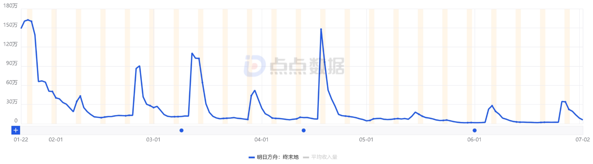
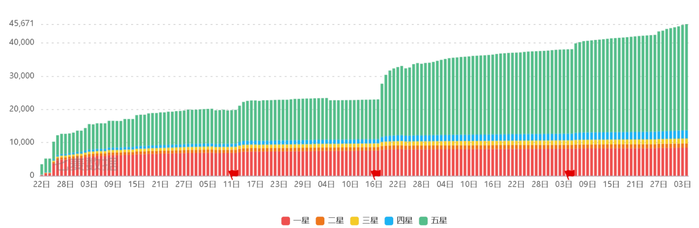
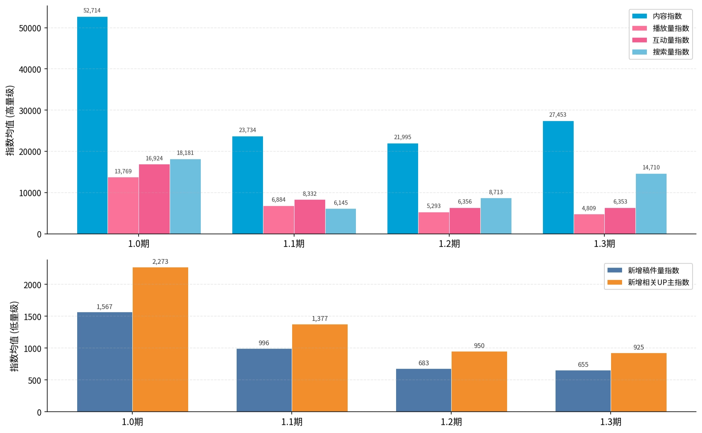

# 《明日方舟：终末地》半年运营节奏复盘

# 摘要

本报告从《明日方舟：终末地》开服半年内呈现内容质量修复期与商业化衰减期错位现象入手，展开对鹰角运营节奏的战略选择的讨论。

从2026/01/22上线至今，《明日方舟：终末地》的表现在商业化维度呈单调衰减，iOS游戏榜峰值排名从公测首日的第5名降至1.3期的第30名附近，App Store日收入峰值从约160万美元降至约30万美元，六个月内新版本首卡池的首7日日均衰减**约88.2%**（莱万汀池1,291,555美元→弭弗池151,942美元）。非商业化维度呈修复态，TapTap评分区间增量口径均分从1.0期的3.04单调回升至1.3期的4.70，一星绝对数降幅**约95%**，同期B站关键词搜索指数在1.1谷底后回升**约139%**；生产端UGC供给（新增稿件量与新增UP主指数）在同窗口单调下降约58-59%。

报告通过版本节奏、商业化、口碑、社区活跃四维方向矩阵观察1.0-1.3期同一时间窗内独立数据轨迹的方向分离，批判性看待商业化衰减，将其作为鹰角"以短期付费深度让位换取长期玩家留存"战略假设的可解释性讨论入口。

第1章建立错位观察证据基础与主命题提出，第2章通过组合拳配置/集成工业三重考量/付费深度光谱三视角验证鹰角战略假设的实践进度，第3章将全球同步作为节奏商业化约束变量单独讨论，第4章从运营视角预测1.4-1.6三版本节奏。

# 引言

本报告采用版本节奏、商业化、口碑、社区活跃四维健康度框架展开观察。商业化维度以iOS三榜峰值排名、App Store日收入曲线、卡池首日与首7日日均流水为核心指标；口碑维度以TapTap评分累计加权平均与区间增量加权平均双口径分离累计存量印象与版本期新增反馈情感；社区内容与搜索维度以B站关键词哔哩指数（内容、播放、互动、搜索）观察消费端热度；用户活跃维度以B站生产端哔哩指数（新增稿件量、新增UP主）作为UGC供给代理。四维在同一时间窗内独立观察，通过方向对比识别错位现象。

数据观察的方法包括但不限于使用iOS畅销榜追踪采用七麦数据观察榜单峰值排名与版本节点回升；App Store总收入曲线采用点点数据（美元口径）观察日收入衰减与卡池首日/首7日日均；TapTap评分采用本报告自建的双口径加权平均观察累计与区间增量的分离信号；B站关键词监测采用哔哩指数六指标观察社区消费端与生产端方向分离；社群讨论定性锚点采用GameLook、17173、游研社、DoNews、TapTap论坛、小红书、知乎、B站UP主等公开渠道补充定量数据外的定性观察。

数据源主要分为三级。L1为官方一手信息，作为主证据使用，包括鹰角官方公告、前瞻直播、官方PV、开发者日志、主创GDC与三测发布会采访；L2为第三方数据平台，作为量化基线使用，包括点点数据、七麦数据、B站哔哩指数、Sensor Tower、数说指数；L3为媒体转述与社群反馈，作为定性锚点与背景补充使用。三级证据在正文引用时均注明数据源与时间戳，数据源完整URL见附录参考文献。

报告面向游戏运营从业者、二游行业观察者与鹰角策略研究者，提供"数据观察→命题提出→战略假设验证→节奏预测"的方法论闭环，不做产品优劣评判、不做投资建议、不做玩家入坑判断。

# **1 版本节奏**

本章从版本节奏、商业化、口碑、社区活跃四维回收《明日方舟：终末地》1.0-1.3期的可观察数据，识别商业化衰减轨迹与口碑修复轨迹之间的错位现象，作为后续讨论的证据基础。

## **1.1 版本节奏时间线**

下表列举了从开服至报告定稿时（2026.7.5）终末地的历史版本更新时间线，包括了版本名称，时间节点，版本持续时长，版本核心内容和运营相关重要事件这五个板块。之后的分析和预测也将以此表的时间线为基础展开。

| 版本 | 日期 | 时长 | 版本核心内容 | 重要事件 |
| --- | --- | --- | --- | --- |
| 1.0公测 | 2026/1/22 | 49天 | 莱万汀+洁尔佩塔+伊冯卡池
启程+常驻活动 | iOS免费第2&畅销第8
PayPal事故 |
| 1.1 新潮起，故渊离 | 2026/3/12 | 35天 | 汤汤+洛茜卡池
养成优化 | 主线质量争议 |
| 1.2 春晓时 | 2026/4/17 | 49天 | 庄方宜卡池
体验全面优化 | 后续版本活动&干员预告 |
| 1.3 寻遗散记 | 2026/6/5 | 42天（预计） | 弥弗+卡缪卡池
危机合约重燃 | 全球飞榜 |
| 1.4  | 2026/7/17 （预计） | - | - | - |

表1 2026/1/22-2026/7/4版本时间线

可以看到，终末地的版本更新时长在一个区间内小幅波动，49-35-49-42天间隔的节奏基本稳定。根据时长可以初步分为大版本（49天）和小版本（42天或更少），大版本更倾向于重要主线剧情和人物的实装，而小版本侧重次要角色实装和全新活动的上线。这种做法在平衡公司的产出压力的同时也控制了游戏的肝度，目前看来是合理的并且会长期运营的规划。

## **1.2 商业数据指标观测**

在此稳态节奏下，畅销榜与卡池流水呈现的观测数据如下：

图1 《明日方舟：终末地》2026年01月22日 - 2026年07月05日iPhone畅销榜排名趋势（数据来源：七麦数据）

《明日方舟：终末地》公测首日（2026/1/22），iPhone总榜、游戏榜、角色扮演榜畅销榜峰值分别录得第8、第5、第1名，此后在3/12、4/17、6/5三次版本更新节点均触发排名回升，回升幅度与持续时长呈递减趋势——1.1节点游戏榜峰值回升至前10名区间，1.3节点游戏榜峰值仅回升至第30名附近。版本间平台期基线同步下移，三榜相对差距在1.3窗口内扩大，角色扮演榜排名维持相对稳定而总榜与游戏榜下探幅度更大。在5/25和6/12出现两次飞榜。

图2 《明日方舟：终末地》2026年01月22日-2026年07月02日App Store总收入（数据来源：点点数据）

同期App Store总收入曲线（数据来源：点点数据，美元）呈现同向变化：公测首日峰值约160万美元，1.1节点峰值约110万美元，1.2节点峰值约150万美元，1.3节点峰值约30万美元，相对1.0首日基线的衰减比例分别为31%、6%、81%。版本间谷值同步下移，1.3窗口内谷值日收入较1.0窗口谷值下降约61%。

上述衰减发生在1.0→1.3之间49-35-49-42天的稳态节奏窗口内。榜单峰值与收入峰值在4个版本节点上时点对齐，衰减方向与幅度呈同步性。

## **1.3 口碑指标观测**

图3 《明日方舟：终末地》2026年01月22日 - 2026年07月04日App Store评分走势（数据来源：七麦数据）

在App Store的评分呈现出的趋势与畅销榜和卡池流水走势相反。累计评价总数从公测的3481条增长至7/4的45671条。其中中间星级占比较少，五星与一星评价的比例从开服后一周的1.44增长到7/4的3.78。

| 版本节点 | 日期 | 累计评价数 | 累计均分 | 环比变化 |
| --- | --- | --- | --- | --- |
| 1.0首日 | 2026-01-22 | 3,481 | 4.65 | — |
| 1.1 | 2026-03-12 | 19,863 | 3.33 | -1.32 |
| 1.2 | 2026-04-17 | 23,020 | 3.39 | +0.06 |
| 1.3 | 2026-06-05 | 38,129 | 3.93 | +0.54 |
| 截止 | 2026-07-04 | 45,671 | 4.06 | +0.13 |

表2 截止2026/7/4累计App Store评分平均分

| 版本区间 | 区间天数 | 增量总数 | 一星△ | 五星△ | 增量均分 |
| --- | --- | --- | --- | --- | --- |
| 1.0期(1/22→3/11) | 49 | 16,296 | 6,671 | 7,085 | 3.04 |
| 1.1期(3/12→4/16) | 35 | 3,108 | 687 | 1,782 | 3.77 |
| 1.2期(4/17→6/4) | 49 | 15,076 | 547 | 13,382 | 4.75 |
| 1.3期(6/5→7/4) | 30 | 7,542 | 333 | 6,543 | 4.70 |

表3 截止2026/7/4各版本App Store评分区间增量加权平均分

App Store评分累计加权平均（整体平均分）在公测首日录得4.65，1.1节点下探至3.33，此后在1.2/1.3两节点回升至3.39/3.93，截至2026-07-04升至4.06。区间增量加权平均（各版本平均分）在1.0期录得3.04，1.1期升至3.77，1.2期升至4.75，1.3期录得4.70。整体平均分反映截至节点日的累计存量印象分，各版本平均分反映版本期新增评价的反馈情感，两口径同向呈现自1.0期低谷向后单调回升的轨迹。

区间增量视角下，一星绝对数从1.0期的6,671下降至1.3期的333，降幅约95%；五星绝对数在1.0/1.1/1.2/1.3四区间分别录得7,085/1,782/13,382/6,543，1.2期录得峰值13,382（该峰值的运营动作归因见第2章2.1段）。1.0期一星与五星绝对数接近持平（6,671 vs 7,085），1.3期一星与五星绝对数量级差扩大至约20倍（333 vs 6,543）。

上述口碑维度信号方向与1.2段商业化维度衰减方向相反，两条独立轨迹的错位需结合社区热度维度共同判读——见1.4段。

## 1.4 社区热度指标观测

图4 《明日方舟：终末地》B站关键词内容量与作者量区间日均值｜2026/01/22-2026/07/04｜数据来源：哔哩指数｜横轴为版本区间

截至2026-07-03，B站关键词"明日方舟终末地"（分区：全站）近30日窗口内内容指数日均27,452.85、播放量指数日均4,809.06、互动量指数日均6,353.35、搜索量指数日均14,710.27。生产端同窗口新增稿件量指数日均654.84、新增相关UP主指数日均925.30。B站官方账号"明日方舟终末地"当前粉丝数录得480.1万，较公测首日GameLook披露值"粉丝破四百万"累计增长约80万，覆盖公测后约164日窗口；该指标反映关注意愿规模，非UGC生产与消费活跃度代理。

以1.0/1.1/1.2/1.3四版本区间（49/35/49/29天）为窗口对齐榜单与收入曲线的节点结构，B站内容指数日均分别录得52,714.10，23,734.36，21,994.98，27,452.85，1.3期较1.0期-47.9%、较1.2期+24.8%，1.1谷底后呈U型反弹（详见图1-5/图1-6）。搜索量指数日均在四区间分别录得18,181.23，6,144.92，8,712.96 ，14,710.27，1.3期较1.0期-19.1%、较1.1期谷底+139.4%，回升幅度大于内容指数。播放量指数与互动量指数呈另一模式：播放量四区间单调下降13,768.60→6,884.49→5,293.03→4,809.06，累计降幅65.1%；互动量四区间录得16,924.44→8,331.72→6,356.31→6,353.35，1.2/1.3期呈平台期。生产端新增稿件量指数日均四区间单调下降1,566.90→996.39→682.66→654.84（累计降幅58.2%），新增相关UP主指数日均同向单调下降2,272.92→1,376.82→950.00→925.30（累计降幅59.3%）。区间内峰谷比自1.0期9.35单调收窄至1.3期2.74，波动幅度趋于稳定。公测窗口存在"游戏开服后仅一个小时，B站涌现出约千名主播同时直播终末地"以及"明日方舟终末地公测实况""明日方舟终末地公测启程PV"话题一同冲上B站热搜榜TOP3的事件锚点（GameLook报道），构成1.0期社区热度峰值的定性锚定。

社区内容与搜索维度在1.0→1.3期呈U型修复态（内容指数1.1谷底后+15.7%、搜索指数1.1谷底后+139.4%），与1.3段口碑维度增量均分3.04→4.70的修复方向一致，与1.2段商业化维度榜单峰值/收入的衰减方向背离。生产端新增稿件量与新增UP主指数在同窗口呈单调下降态，与1.2段商业化衰减方向一致，与1.3段口碑修复方向背离。当口碑与社区内容/搜索三条独立轨迹的修复方向与商业化及生产端两条独立轨迹的衰减方向分离时，商业化维度衰减的运营含义需结合四维方向矩阵重新判读——见1.5段。

## 1.5 四维方向解读

回收1.2商业化、1.3口碑、1.4社区内容与用户活跃四维证据，以1.0期与1.3期两时点锚点形成方向矩阵如下。

| 维度 | 1.0期锚点 | 1.3期锚点 |
| --- | --- | --- |
| 商业化 | iOS游戏榜峰值第5/角色扮演榜峰值第1/日收入峰值约160万美元 | 游戏榜峰值第30名附近/日收入峰值约30万美元/5-25与6-12两次跌出前200 |
| 口碑（增量口径） | 增量均分3.04/一星△6,671/五星△7,085 | 增量均分4.70/一星△333/五星△6,543 |
| 社区内容热度 | 内容指数日均52,714/播放指数13,769 | 内容指数日均27,453（1.2→1.3+24.8%）/播放指数4,809 |
| 用户活跃（B站生产端） | 新增稿件量指数1,567/新增UP主指数2,273 | 新增稿件量指数655/新增UP主指数925 |

表4 《明日方舟：终末地》1.0-1.3版本四维数据汇总表

商业化维度iOS三榜峰值排名与App Store日收入自1.0期至1.3期整体呈衰减轨迹，1.1/1.2/1.3三次版本节点收入峰值较1.0首日基线（约160万美元）的衰减比例分别为31%/6%/81%，1.2节点收入峰值基本回到首日基线量级，1.3窗口衰减最深至81%，5-25与6-12两次跌出前200加剧衰减信号。口碑维度增量口径均分自1.0期3.04单调回升至1.3期4.70，一星绝对数从6,671下降至333（-95.0%），五星在1.2期录得区间峰值13,382后于1.3期回落至6,543。社区内容热度维度呈方向混合态，内容指数与搜索指数在1.1期录得谷底后U型反弹（1.1谷底至1.3期内容指数+15.7%、搜索指数+139.4%），播放指数四区间单调下降（13,769→4,809），互动指数于1.2/1.3期录得平台期（6,356/6,353）。用户活跃维度以B站生产端新增稿件量与新增UP主指数为代理，两指标四区间单调下降（稿件量1,567→655、UP主2,273→925）。

四维方向矩阵中，商业化与用户活跃生产端呈现衰减轨迹，口碑与社区内容/搜索热度呈现自1.1谷底后的修复轨迹，四条独立数据轨迹在同一时间窗内进入不同变化方向。本报告将"商业化衰减轨迹与口碑/社区修复轨迹在1.1谷底后进入不同变化方向"这一现象称为**错位**，全段"错位"一词仅指此现象，不引申方向背反或时间错峰含义。

基于四维方向矩阵与错位观察，正式提出本报告的命题：“**内容质量修复期与商业化衰减期错位——回顾终末地开服半年内鹰角运营节奏的战略选择”**。以1.1谷底至1.3窗口（2026-04-08至2026-07-04）为主要观察时段，以49/35/49/49天的稳态版本节奏为时间结构，将商业化衰减不作为孤立"产品塌陷"信号判读，而作为鹰角运营节奏可解释性讨论的入口。

# **2 活动配置与商业化**

本章回观察鹰角"以短期付费深度让位换取长期玩家留存"的战略假设在1.0-1.3期后的进度，通过活动配置、集成工业三重考量、付费深度定位视角验证，识别假设仍处于持续迭代期而非终局裁定。

## 2.1 部分活动运营意图推测与玩家反应对照

本节重点拆解1.0-1.3期鹰角的四件组合拳动作，按版本节奏稳态、武器池解绑、免费月卡、危机合约的顺序，以运营意图（A层：官方言论，B层：本报告推断）与玩家实际反应双列对照。四件动作的运营意图A层与B层均设显式区分标识，若鹰角官方未公开说明具体意图，以下B层为本报告基于同类动作历史效果与鹰角原作明日方舟运营节奏的推断。

### **动作一 · 版本节奏稳态（49-36-49-29天，1.0期起贯穿）**

运营意图A层：鹰角官方对1.0-1.3期版本节奏窗口未见显式意图声明，仅在1.1版本开发者日志中承诺"开发透明度和系统性信息传达"以及1.2版本前瞻中确认版本更新节奏。

运营意图B层：稳定的版本节奏窗口作为运营节奏容器，承载后续动作，节奏本身即长期主义战略的显性配置——该配置与鹰角原作明日方舟的30-45天版本周期基本处于同一节奏区间，但1.3期29天窗口较前三期显著收窄。

玩家实际反应：1.4段哔哩指标数据显示，B站关键词内容指数区间峰谷比自1.0期9.35单调收窄至1.3期2.74，波动幅度趋稳，玩家侧未将节奏问题作为主要吐槽点；1.2/1.3期TapTap增量口径均分4.75/4.70基本持平，节奏稳定与商业化1.3窗口衰减81%并存但未被玩家等同判读。

### **动作二 · 武器池解绑（公测2026-01-22定型）**

运营意图A层：官方未对武器池独立化设计做显式意图声明；GamesRadar+ GDC期间主创Ryan采访提到"东西方玩家对抽卡系统的接受程度不一样"，会通过"增加免费抽卡资源、在游戏前期加入自选角色券、合并部分货币种类、反馈问卷和游戏内数据"等手段降低抽卡系统对玩家的负面影响。

运营意图B层：武器池与角色池分离（独立货币"武库配额"、独立40/80抽保底、大保底不继承、不支持单抽）是承接偏重度玩家武器满配需求的付费深度层设计，方向上不同于鹰角原作明日方舟"抽到干员就完事"的设计传统，向米式（原神/崩铁）付费深度模型靠拢。

玩家实际反应：2026-01-16 TapTap刷屏"劝退天花板/强制满抽/大保底换池清零"，玩家集体呼吁保底继承规则未获调整；1.3段口碑口径B一星自1.0期6,671衰减至1.3期333（-95%），初印象负面反应在增量口径已大幅消退但1.0期累计口碑锚点已定型（口径A首日4.65下探至1.1的3.33）。此后关于武器池的辩论一直持续，玩家更多从最初的抱怨转向资源量分析和解决方法的思考。

### **动作三 · 免费月卡（1.2版本期 2026-04-17起）**

运营意图A层：1.2「春晓时」版本官方福利文案层面，追加"焕新月卡赠礼"+月卡每日奖励追加理智消耗许可×4+基于4/11至更新前月卡领取记录追加补偿+购买过月卡玩家一次性补偿120理智消耗许可。

运营意图B层：在1.1商业化谷底后（1.1节点收入峰值约110万美元较1.0基线160万美元衰减31%）加大福利投放，以维持DAU与存量玩家情感留存——该动作属于典型的"内容+福利双加码"回应型运营，继承了原作明日方舟重要节点更新时赠送月卡的传统。

玩家实际反应：玩家群体呈"感谢福利加码"与"救火信号解读"并存的分化反应；1.3段口碑口径B均分1.2期峰值4.75+五星区间峰值13,382同步出现在1.2期，福利加码与口碑修复方向一致；1.2段商业化1.2节点收入峰值约150万美元较1.0基线仅衰减6%，1.2期商业化短暂回暖与福利加码同期发生。

### **动作四 · 危机合约（1.2版本前瞻预告，1.3期2026-06-19上线）**

运营意图A层：官方定位为限时挑战玩法，玩家自由选择挑战指标组合定制难度，单局设4个波次，鼓励玩家探索更高难度，所有奖励易获取；活动沿用鹰角原作明日方舟标志性长线活动名，1.4版本预告"危机合约一"进一步复用该品牌。

运营意图B层：引入原作IP的成熟长线活动模式，服务偏硬核玩家群体，强化3D动作战斗系统的深度可玩性——属于典型的留存维深度玩法动作，与商业化维度弱关联；1.2前瞻预告-1.3实际上线的"预告-延后"节奏是鹰角历史节奏的常见配置，本身不构成异常。

玩家实际反应：玩家评价分化，"高难度组合考验配队""建议新手从低难度开始逐步提高"；1.3期TapTap口径B均分4.70基本持平1.2期4.75，未见危机合约上线对口碑的显著增量推动；1.4段哔哩搜索指数1.3期14,710较1.1期谷底6,145回升+139.4%，搜索侧U型反弹的时点与危机合约上线（6/19）位于同一窗口。同时，原作明日方舟也举行了新的一期危机合约活动，巩固了玩家对活动的印象和社群讨论热度。

## 2.2 集成工业设计的三重考量验证

三重考量的原始表述来源于鹰角战斗与关卡策划RUA牛在2025年11月三测发布会前后接受automaton与游戏动力等媒体采访时的分述，本报告将其凝练为"集成工业设计的三重考量"，此命名系本报告基于多源采访的概括，非鹰角官方一次性提出的框架。

| 考量维度 | 设计意图 | 1.0-1.3期后观察 | 持续迭代记录 |
| --- | --- | --- | --- |
| 好玩 | 探索与工厂两大板块的融合形成核心乐趣 | 1.3段口碑增量口径均分录得4.70（1.0期3.04起点后单调回升）；1.4段B站内容指数与搜索指数在1.1谷底后呈U型反弹（内容指数+15.7%、搜索指数+139.4%） | 1.2版本新增蓝图分享系统，硬核玩家设计的高效产线可被轻度玩家一键复制，社区形成互助生态（GameLook 2026-01报道） |
| 沙盒传播 | 玩家主动参与改造游戏生态 | 小红书讨论区在1.3版本上线后存在"每次更新都要重新拉电线"类表述，反映沙盒改造在版本更新节点的**衔接体验**处于持续观察中；1.4段B站生产端新增稿件量指数与新增UP主指数四区间日均呈单调下降（1,566.90→654.84与2,272.92→925.30） | 1.2期电力连接缓冲距离从10米增至20米且不再被剧情对话打断；1.3期集成工业新增【备用电源】机制、地区建设界面新增【事物总览】面板、日常任务累计击敌数从20降至10、60/120理智任务活跃度奖励从10点提升至20点（233乐园2026-06报道） |
| F2P新鲜感 | 长线运营中不常见的玩法带来新鲜感 | 1.4段火烧云生产端指标反映UGC创作供给自1.0期高峰逐区间回落；1.3期TapTap口径B均分持平1.2期，未见新鲜感维度的显著新增推动 | 鹰角在GameLook 2026-03 automaton采访中明确后续方向：基建玩法会朝着多元化的方向拓展，去丰富玩家的体验，而不是单纯地去提升基建系统的复杂度；1.3期集成工业模块新增机制持续印证多元化方向 |

表5 集成工业设计的三重考量 · 1.0-1.3期后观察

持续迭代本身即命题C所述"鹰角运营节奏战略选择"的直接体现——迭代未止=战略未收束，1.4段生产端指标衰减态与1.3段口碑修复态的并存不因迭代动作解决而消失，两者是同一战略选择的一体两面。

集成工业作为核心玩法在玩家单次会话内占用较多注意力时间，规划电力网络、铺设传送带、计算矿石产出效率的操作对不同玩家群体的接受度存在差异——GameLook 2026-01报道指出，对于习惯了传统二游"上线5分钟清体力"模式的轻度玩家而言，需要在3D地图中规划电力网络、铺设传送带、计算矿石产出效率，这无疑是一次巨大的认知冲击；而对于自动化游戏的受众来说，同一套系统被评价为"降维打击般的快乐"。同时，角色养成与抽卡付费维度所需的碎片化短会话与多次登录节奏，与集成工业单次深度会话在部分玩家群体中形成时间分配上的隐性竞争。

鹰角在1.2/1.3期通过一系列减负动作部分回应了上述资源冲突：1.2期开放帝江号中枢一键收菜、电力连接缓冲距离扩至20米、防剧情打断；1.3期日常任务累计击敌数从20降至10、60/120理智任务活跃度奖励从10点提升至20点、集成工业新增备用电源与事物总览面板。上述动作部分回应了核心玩法与养成节奏的时间冲突。玩家侧反馈呈分化态——小红书讨论区在1.3版本上线后仍存在"每次更新都要重新拉电线"类表述，说明版本节点后沙盒改造的衔接体验在部分玩家群体中仍需持续观察；同期GameLook 2026-02报道显示，游戏公测两周全球全平台累计流水突破12亿元，PC端与PS端合计占比达70%，反映集成工业玩法在硬核受众群体的付费转化维度形成了差异化优势。

## 2.3 付费深度光谱定位与模式偏离

本节从付费深度维度进一步验证鹰角战略选择的定位——将终末地1.0-1.3期的卡池流水衰减曲线与同期上线的二游产品做付费光谱对比，识别其在品类光谱中的位置及相对母作明日方舟的偏移方向。

依据点点数据App Store总收入序列（2026-01-22至2026-07-03，日频，美元口径），锚定各版本开卡池首日的iOS总收入：1.0期莱万汀池首日（2026-01-22）录得1,488,431美元、1.0期洁尔佩塔池首日（2026-02-07）录得350,365美元、1.0期伊冯池首日（2026-02-24）录得863,833美元；1.1期汤汤池首日（2026-03-12）录得1,107,213美元、洛茜池首日（2026-03-29）录得439,143美元；1.2期庄方宜池首日（2026-04-17）录得72,662美元、1.3期弭弗池首日（2026-06-05）录得227,584美元。各卡池首7日日均口径下的衰减更为明显——1.0期莱万汀池首7日日均1,291,555美元，1.3期弭弗池首7日日均151,942美元，六个月内新版本首卡池的首7日日均口径录得约88.2%的衰减幅度。数据全周期最低日为2026-05-29的15,479美元，最高日为2026-01-24的1,624,199美元。该衰减曲线与1.2段商业化维度收入曲线的方向一致，与1.3段口碑增量口径修复方向、1.4段社区内容与搜索指数U型反弹方向呈现1.5段所述错位特征。

| 产品 | 主要付费结构 | 光谱位置 |
| --- | --- | --- |
| 二重螺旋（潘神工作室/英雄游戏，2025-10-28全球公测） | 取消角色抽卡+取消武器抽卡+取消体力系统+仅售外观皮肤+全角色武器免费获取（局内积累碎片合成） | 全免费商业模式相对极端点候选（本报告观察范围内） |
| 明日方舟（鹰角，2019） | 干员池（无独立武器池）+至纯源石+月卡+皮肤+复刻活动+集成战略肉鸽（不涉付费） | 付费深度中偏轻 |
| 明日方舟：终末地（鹰角，2026-01-22全球公测） | 干员池+**武器池独立化**（武库配额独立、40/80抽保底、大保底不继承）+1.2起免费月卡+付费月卡叠加+皮肤+集成工业不直接涉付费 | 付费深度中偏重 |
| 卡厄思梦境（Smilegate/腾讯，2025-10-22国际服/2026-05-28国服） | 新手池200选10+多主战员/辅战员卡池+装备+伙伴+记忆碎片多层养成+累计73抽登录送+按付费金额返还月石+多档礼包+存档系统付费入口 | 付费广度相对极端点候选（本报告观察范围内） |

表6 二游付费深度光谱四点定位

本报告付费光谱定位以2025-2026年上线的主流二游产品为观察范围，"相对极端点候选"表述指本观察范围内的相对极值，不排除存在更极端定位的产品；光谱位置仅描述付费结构的相对复杂度与广度，不做产品优劣判断。

点点数据《2025年二次元移动游戏体验评测分析报告》（2025-12-09发布）指出，2025年中国二次元移动游戏市场进一步加剧了下滑趋势，二游产品出现了"商业化、养成体系乃至玩法层面的明显定式"，玩家审美疲劳与消费比例部分转移（谷子经济）同期发生；报告将《二重螺旋》完全抛弃抽卡商业化转向纯Avatar付费列为战略调整代表案例。数说指数2025年10月二次元游戏互动榜显示，《二重螺旋》互动量环比激增2071.02%，但公测后用户反馈迅速转向负面（玩法空洞、技术优化不足），呈"上线即巅峰"特征。GameLook 2025-01专稿将鹰角在集成工业玩法+全球同步发行上的选择定位为"规避二游普遍版本陷阱的差异化战略"。上述行业背景显示，终末地在付费光谱中所处的"母作延伸+米式借鉴混合定位"，是2025-2026年二游品类付费模式集体探索期的一种战略选择，而非孤立现象。

付费深度光谱定位显示，终末地相对鹰角原作向"付费深度加码"方向偏移但未达卡厄思梦境的付费广度极值，处于混合定位；卡池流水在1.0-1.3期录得约88.2%的首7日日均衰减，衰减方向与商业化维度、生产端活跃维度一致，与口碑修复、社区内容搜索U型反弹呈错位。该判读基于国内市场App Store单口径观察——终末地作为鹰角首次全球同步发行产品，全球流水结构（GameLook 2026-02报道公测两周全球全平台流水12亿元、PC端与PS端合计占比70%）尚未纳入本节判读；全球同步发行作为节奏商业化变量对付费模型的口径影响，见第3章。

# **3 全球同步作为节奏商业化变量**

本章聚焦终末地作为鹰角首次全球同步发行产品的节奏配置，将全球同步作为影响付费模型判读的约束变量，识别全球流水结构与国内单市场观察之间的口径差异。受限于个人用户数据获取渠道，部分分析仅做定性判断。

## 3.1 全球同步的收入结构基线

《明日方舟：终末地》1.0期公测（2026-01-22）同步登陆PC/Android/iOS/PS5四端，全球59个国家和地区iOS免费榜登顶，24个市场进入iOS畅销榜前50，首月全球累计下载突破3,000万（TapTap论坛资讯评论员援引数据）。收入维度，上海徐汇区官方账号2026-02-07披露公测两周全球全平台累计流水突破12亿元，其中国内市场PC端流水占比近60%、海外市场PC端与PS端合计占比达70%（游研社2026-02-07转载）；首月全球移动端Sensor Tower预估约4,600万美元（TapTap论坛资讯评论员援引Sensor Tower数据）。Sensor Tower 2026-04-09发布的分域数据显示，1.0期公测后首季移动端收入结构呈现日本市场占比32%反超中国本土25%，日本下载量占比仅12%但每下载收益约15美元（cgames.com 2026-04-09报道）

## 3.2 全球同步带来的三层结构性限制

全球同步发行在1.0-1.3期呈现三层可观察的结构性限制。多端审核对版本发布日增加限制——PC/Android/iOS/PS5各端有独立审核链路，任一端审核阻塞即影响全端同步发布节奏，鹰角自1.0期起选择四端同一日公测的节奏是与之匹配的配置；多语言本地化占用产能——全球同步发行对本地化产能提出持续要求，鹰角在PayPal事故后已开始招聘"海外支付产品运营和项目法务"等海外配套岗位（DoNews 2026-01-23报道），本地化与海外运维需长期占用团队产能；海外舆情响应存在时差——1.0期首个卡池莱万汀开池日（2026-01-22公测首日）曝出的PayPal支付事故是运维准备缺口的一次呈现：因支付订单与UID未一一关联，出现玩家账户被自动扣款情况，官方在24小时内停用PayPal支付通道并全额退款审查（新浪财经/国际金融报2026-01-23报道），事件的技术定性与响应节奏在中英文舆论场呈现出可观察的响应时差；本报告不将该事故独立成危机案例，仅作为运维准备缺口在全球同步场景下的一次观察窗口。

## 3.3 分域数据的适用边界校验

Sensor Tower首季分域数据显示的日本反超中国结构，与1.2段国内iOS总榜/游戏榜/角色扮演榜自1.0期至1.3期的衰减轨迹（榜单峰值排名从第5降至第30名附近、iOS日收入峰值从约160万美元降至约30万美元）形成口径差异——1.2段观察为国内iOS单口径，1.0期两周全球12亿元中国内移动端估算占比明显低于50%（游研社推算国内移动端约占2成、剩余为PC+海外）。在第一章总结中所描述的"商业化衰减"在国内iOS单口径下方向明确，在全球多市场多平台口径下的对等观察尚需版本节奏内的分域数据持续补齐；本报告受限于公开数据可得性，仅报告Sensor Tower首季分域截面数据，未获得1.1/1.2/1.3期分域的日频/周频对等序列。

全球同步发行在1.0-1.3期已呈现三层结构性限制的观察点，PayPal事故作为运维准备缺口的一次观察窗口嵌入其中；分域收入结构显示日本市场首季反超中国、海外PC+PS端占比达70%，与国内iOS单口径观察下的衰减轨迹在颗粒度上不对等。若先前所描述的运营节奏在1.4-1.6版本继续维系，全球同步作为长期变量将对周年节点的分域配置、多端审核节奏、本地化产能分配持续形成结构性输入，见第4章。

# **4 1.4-1.6版本预测**

本章将前三章的观察延伸至未来三个版本与首个周年节点，推断在本报告的命题成立前提下鹰角的配置模式，同时列出可能推翻推断的边界条件。

## **4.1 1.4-1.6三版本预测**

本节以2026-07-05为预测基线，1.4-1.6版本官方公开材料截至2026-06-30。预测重点在于体现运营意图与节奏卡位，而非具体干员或剧情预测的准确性。大版本与小版本沿用第1章定义——大版本以49天窗口对应主线剧情与重要角色实装、小版本以42天或以下对应次要角色实装与活动上线，版本强度与时长共同决定。

### 4.1.1 1.4版本 · 半周年

**预计上线**：2026-07-17（7月10日前瞻直播已官方官宣，17日为惯例上线日）；上线至下一版本时长约50天，落入大版本区间。

**战略意图**：1.4占据半周年节点（2026-07-22公测半周年日），官方6月发布的先导PV"重返北境"与IGN公开的北部禁区核心章节宣传片指向主线武陵上半收尾+北部禁区开启双段结构。卡池为李织烟（上半）+小偶像机娘（下半）。半周年节点通常伴随福利加码，社群基于明日方舟母作历史节奏推测本作可能延续"半周年赠送六星干员"福利，但本作是否延续尚待前瞻直播确认。运营意图上，1.4在节点性上占据半周年、在时长上落入大版本区间、在内容强度上完成前主线收尾并开启新地图，三项配置构成主命题所述稳态节奏的延续。同时，相对较多的福利发放、可能的赠送干员和北部禁区双地图开启也是一个很好的流失玩家召回期，可能会开启网页活动进行拉新。

**关键风险信号**：小偶像作为下半卡池干员在社群已出现评价分化，若下半卡池热度显著低于上半，将呈现半周年版本内部前后半段商业强度分裂；两卡池干员的社群预期热度均未达1.2庄方宜量级，1.4的商业强度可能低于其时长与节点性所对应的预期。此外，社群自1.3期以来对巨兽代理人的持续攒资源预期已实际影响1.4卡池的抽取意愿——玩家可能舍弃1.4部分抽取以保留资源给后续版本，这一意愿分流本身即1.4商业强度的下压因素。

**可验证锚点**：上线日期是否为2026-07-17；月卡福利具体形式与数量；半周年是否赠送六星干员及具体干员；首7日iOS总收入日均（对标1.2庄方宜池首7日日均550,258美元、1.3弭弗池首7日日均151,942美元）。

### 4.1.2 1.5版本 · 北部禁区开启

**预计上线**：2026-09-04前后（1.4后约49天）；时长倾向42天，落入小版本区间。

**战略意图**：1.5承接1.4半周年后的内容延续，本报告推测其作为大版本承担武陵新主线开启+卫星实装双重功能。从运营决策层面看，1.5作为距离周年庆节点尚有约5个月缓冲的中段版本，是投放新主线角色的合适节点——通过1.4和1.5的主线推进增加角色人气和讨论度，同时回应1.4前瞻中可能预告的新角色的内容。在当前时间节点关于新角色的信息相对空白，故不多做陈述。版本运营节奏可以参考1.1版本，通过活动设计（新限时活动+镀层蚀刻章）维持住半周年结束后的新老玩家的日活。

**关键风险信号**：新主线开启节奏若与1.4武陵收尾之间缺乏叙事衔接张力，1.5可能面临内容承接乏力的社群评价；巨兽代理人作为单卡池干员的社群预期热度目前观察窗口极短，风险信号需在7月前瞻直播后重新观察。

**可验证锚点**：1.4前瞻中是否放出新角色立绘/剪影；1.4至1.5间隔天数是否落入42天区间；1.5卡池干员是否为1.4预告过的新角色；是否开启新主线篇章；活动配置强度（对标1.3）。

### 4.1.3 1.6版本 · 周年庆前铺垫

**预计上线**：2026-10中旬至11月初（1.5后约42天）；时长倾向49天，落入大版本区间。

**战略意图**：1.6作为2027-01-22公测周年前的倒数第二个常规版本，可能承担周年庆高商业强度爆点前的铺垫位置。本报告推测巨兽代理人可能在1.6版本登场，依据如下三条：

- (a) 1.2前瞻直播已确认巨兽代理人会实装但具体版本未公开——从1.2至今已经过1.3/1.4两个版本窗口，社群对其登场版本的预期集中在1.5-1.6区间；1.6版本是释放该角色的最后合适节点。1.7版本（周年前最后一个版本）需要给周年的重点角色进行铺垫，并且给玩家留出攒资源的时间，没有成为合适节点的落脚点。
- (b) 巨兽代理人在话题热度与社群热度上与1.2庄方宜类似——同为大幅度超出常规限定预期的高热度角色。类似量级的角色通常投放在需要商业强度支撑的版本上，1.6作为周年前铺垫版本需要该级别角色维持商业强度，避免小版本时长下的商业强度过度衰减。
- (c) 玩家自1.3期以来的持续攒资源预期需在合适节点释放——若巨兽代理人推迟至周年版本或周年后，1.6作为小版本时长会因缺乏高热度卡池干员而商业强度偏低；若在1.5释放，则与周年庆版本的商业爆点存在4个月的间隔，资源池将有充分时间恢复，反而弱化周年爆点。因此从运营决策的资源池管理角度，1.6是巨兽代理人卡池的合适卡位。

**关键风险信号**：预测窗口距今约4-6个月，可验证锚点极少，风险信号识别精度低。若巨兽代理人被推迟至周年版本，1.6商业强度可能显著低于1.5，形成"小版本时长+低商业强度"的双低配置。

**可验证锚点**：上线日期与1.5间隔天数是否收窄至35-42天区间；卡池是否为巨兽代理人。

1.4-1.6三版本节奏在1.0-1.3期已建立的稳态窗口内继续延伸，时长与强度组合分别指向大版本+大版本+小版本的配置。若1.4-1.6节奏预测成立，2027-01-22公测首个周年节点将同时面对周年爆点的商业强度需求与1.0-1.6期建立的稳态节奏一致性要求。

# 附录

## 计算公式

TapTap评分累计口径A公式为**累计均分 = (1×累计一星 + 2×累计二星 + 3×累计三星 + 4×累计四星 + 5×累计五星) / 累计总评价数**，取值时点为版本节点当日累计值。

TapTap评分区间增量口径B分两步计算：**区间增量星级 = 本区间终日累计星级 - 本区间首日前一日累计星级**，再代入**区间增量均分 = (1×一星增量 + 2×二星增量 + 3×三星增量 + 4×四星增量 + 5×五星增量) / 区间增量总评价数**；取值窗口为四版本区间1.0期（2026-01-22至2026-03-11，49天）、1.1期（2026-03-12至2026-04-16，35天）、1.2期（2026-04-17至2026-06-04，49天）、1.3期（2026-06-05至2026-07-04，30天，为数据抓取截止时的进行中天数）。示例验算：1.0期增量总数16,296、一星增量6,671、五星增量7,085，代入得增量均分3.04（与正文表3一致，保留2位小数）。

哔哩指数区间日均口径公式为**区间日均指数 = SUM(区间内每日指数值) / 区间天数**，六指标（内容/播放/互动/搜索/新增稿件量/新增相关UP主）分别独立计算；区间划分与TapTap口径B一致，其中1.4段哔哩指数1.3期取值窗口为2026-06-05至2026-07-03（29天，因哔哩指数抓取截止2026-07-03较TapTap抓取截止2026-07-04少一日）。指数为哔哩指数平台原生指数化数值，非绝对量口径，不做跨平台绝对量对比。

峰谷比公式为**峰谷比 = 区间内内容指数单日最高值 / 区间内内容指数单日最低值**。示例验算：1.0期峰值178,660.64、谷值19,102.05，代入得9.35（与正文1.4段一致）。

卡池首7日日均公式为**卡池首7日日均 = SUM(开卡池日至开卡池日+6日的App Store日总收入) / 7**。数据源为点点数据App Store总收入序列（美元口径），含同期所有卡池收入，无法拆分单卡池贡献。示例验算：莱万汀池2026-01-22至2026-01-28七日收入均值1,291,555美元（与正文2.3段一致）。六个月内新版本首卡池的首7日日均衰减幅度=(莱万汀池首7日日均 - 弭弗池首7日日均) / 莱万汀池首7日日均 = (1,291,555 - 151,942) / 1,291,555 ≈ 88.2%。

## 术语表

| 术语 | 定义 | 位置 |
| --- | --- | --- |
| 大版本 | 时长约49天窗口，倾向重要主线剧情与重要角色实装的版本 | 1.1段 |
| 小版本 | 时长约42天或以下窗口，倾向次要角色实装与全新活动上线的版本 | 1.1段 |
| 飞榜 | iOS畅销榜排名跌出前200，本报告以点点数据/七麦数据榜单口径为准 | 1.2段 |
| 累计口径（口径A） | TapTap评分累计加权平均口径，反映截至节点日的累计存量印象 | 1.3段 |
| 增量口径（口径B） | TapTap评分区间增量加权平均口径，反映版本期新增评价的反馈情感 | 1.3段 |
| 哔哩指数 | B站关键词监测的六指标平台原生指数化数值，含内容/播放/互动/搜索/新增稿件/新增UP主 | 1.4段 |
| 错位 | 商业化衰减轨迹与口碑/社区修复轨迹在1.1谷底后进入不同变化方向，仅指此现象，不引申方向背反或时间错峰含义 | 1.5段 |
| 主命题 | 本报告核心命题"内容质量修复期与商业化衰减期错位——回顾终末地开服半年内鹰角运营节奏的战略选择" | 1.5段 |
| 四维方向矩阵 | 商业化/口碑/社区内容与搜索/用户活跃四维在同一时间窗独立观察形成的方向对比结构 | 1.5段 |
| 组合拳 | 鹰角1.0-1.3期的四件运营动作组合：版本节奏稳态+武器池解绑+免费月卡+危机合约 | 2.1段 |
| 武器池解绑 | 武器池与角色池分离设计，独立货币"武库配额"、40/80抽保底、大保底不继承、不支持单抽 | 2.1段 |
| 危机合约重燃 | 1.3期2026-06-19上线的限时挑战活动，沿用鹰角原作明日方舟长线活动名 | 2.1段 |
| 集成工业设计的三重考量 | 好玩（策略性游戏乐趣）+沙盒传播（玩家主动参与改造游戏生态）+F2P新鲜感（长线运营中不常见的玩法），本报告基于多源采访的概括 | 2.2段 |
| 母作延伸+米式借鉴混合定位 | 终末地相对鹰角原作明日方舟向"付费深度加码"方向偏移但未达卡厄思梦境的付费广度极值，处于混合定位 | 2.3段 |
| 全球同步作为节奏商业化变量 | 全球同步发行作为影响付费模型判读的约束变量，含多端审核对版本发布日增加限制/多语言本地化占用产能/海外舆情响应时差三层结构性限制 | 3章章首 |

## 参考链接

本附录参考文献按正文首次引用出现顺序编号，同一来源多次引用仅在首次编号，编号与发布日期无关。

[1] 七麦数据，iPhone畅销榜排名趋势与App Store评分历史，[https://www.qimai.cn（首次引用：1.2段图1、1.3段图3）](https://www.qimai.cn%EF%BC%88%E9%A6%96%E6%AC%A1%E5%BC%95%E7%94%A8%EF%BC%9A1.2%E6%AE%B5%E5%9B%BE1%E3%80%811.3%E6%AE%B5%E5%9B%BE3%EF%BC%89)

[2] 点点数据，App Store总收入序列，[https://www.diandian.com（首次引用：1.2段图2、2.3段卡池首日/首7日日均）](https://www.diandian.com%EF%BC%88%E9%A6%96%E6%AC%A1%E5%BC%95%E7%94%A8%EF%BC%9A1.2%E6%AE%B5%E5%9B%BE2%E3%80%812.3%E6%AE%B5%E5%8D%A1%E6%B1%A0%E9%A6%96%E6%97%A5/%E9%A6%967%E6%97%A5%E6%97%A5%E5%9D%87%EF%BC%89)

[3] 哔哩指数，B站关键词六指标监测，[https://www.bilibili.com/BW/index（首次引用：1.4段图4）](https://www.bilibili.com/BW/index%EF%BC%88%E9%A6%96%E6%AC%A1%E5%BC%95%E7%94%A8%EF%BC%9A1.4%E6%AE%B5%E5%9B%BE4%EF%BC%89)

[4] GameLook，《上线一周的终末地赢得"多反常"？》2026-01，[https://www.gamelook.com.cn/2026/01/586760/（首次引用：1.4段"粉丝破四百万"披露值、2.2段基建认知冲击）](https://www.gamelook.com.cn/2026/01/586760/%EF%BC%88%E9%A6%96%E6%AC%A1%E5%BC%95%E7%94%A8%EF%BC%9A1.4%E6%AE%B5%22%E7%B2%89%E4%B8%9D%E7%A0%B4%E5%9B%9B%E7%99%BE%E4%B8%87%22%E6%8A%AB%E9%9C%B2%E5%80%BC%E3%80%812.2%E6%AE%B5%E5%9F%BA%E5%BB%BA%E8%AE%A4%E7%9F%A5%E5%86%B2%E5%87%BB%EF%BC%89)

[5] GamesRadar+ 主创Ryan采访，GDC期间对抽卡系统的说明（首次引用：2.1段动作二运营意图A层）

[6] TapTap公测卡池讨论帖，2026-01-16（首次引用：2.1段动作二玩家实际反应）

[7] BiliBili WIKI「春晓时」页，1.2版本福利细节，[https://wiki.biligame.com/zmd/春晓时（首次引用：2.1段动作三运营意图A层）](https://wiki.biligame.com/zmd/%E6%98%A5%E6%99%93%E6%97%B6%EF%BC%88%E9%A6%96%E6%AC%A1%E5%BC%95%E7%94%A8%EF%BC%9A2.1%E6%AE%B5%E5%8A%A8%E4%BD%9C%E4%B8%89%E8%BF%90%E8%90%A5%E6%84%8F%E5%9B%BEA%E5%B1%82%EF%BC%89)

[8] 知乎@大白兔奶糖，1.2春晓时前瞻直播评价，[https://www.zhihu.com/question/2026395651970212125（首次引用：2.1段动作三玩家实际反应）](https://www.zhihu.com/question/2026395651970212125%EF%BC%88%E9%A6%96%E6%AC%A1%E5%BC%95%E7%94%A8%EF%BC%9A2.1%E6%AE%B5%E5%8A%A8%E4%BD%9C%E4%B8%89%E7%8E%A9%E5%AE%B6%E5%AE%9E%E9%99%85%E5%8F%8D%E5%BA%94%EF%BC%89)

[9] 网易云游戏，1.3危机合约攻略（首次引用：2.1段动作四运营意图A层）

[10] 游侠网，RUA接受automaton采访转载，2025-11-14，[https://www.ali213.net/news/html/2025-11/981141.html（首次引用：2.2段三重考量·好玩维度原文）](https://www.ali213.net/news/html/2025-11/981141.html%EF%BC%88%E9%A6%96%E6%AC%A1%E5%BC%95%E7%94%A8%EF%BC%9A2.2%E6%AE%B5%E4%B8%89%E9%87%8D%E8%80%83%E9%87%8F%C2%B7%E5%A5%BD%E7%8E%A9%E7%BB%B4%E5%BA%A6%E5%8E%9F%E6%96%87%EF%BC%89)

[11] 游戏动力知乎专栏，三测发布会报道，2025-11-14，[https://zhuanlan.zhihu.com/p/1972692921867323102（首次引用：2.2段三重考量·沙盒传播与F2P新鲜感原文）](https://zhuanlan.zhihu.com/p/1972692921867323102%EF%BC%88%E9%A6%96%E6%AC%A1%E5%BC%95%E7%94%A8%EF%BC%9A2.2%E6%AE%B5%E4%B8%89%E9%87%8D%E8%80%83%E9%87%8F%C2%B7%E6%B2%99%E7%9B%92%E4%BC%A0%E6%92%AD%E4%B8%8EF2P%E6%96%B0%E9%B2%9C%E6%84%9F%E5%8E%9F%E6%96%87%EF%BC%89)

[12] GameLook，《游戏圈80%的焦虑，也许都能被终末地的二十英里法则化解》2026-02，[https://www.gamelook.com.cn/2026/02/587645/（首次引用：2.2段资源冲突段全球流水12亿与PC/PS端70%）](https://www.gamelook.com.cn/2026/02/587645/%EF%BC%88%E9%A6%96%E6%AC%A1%E5%BC%95%E7%94%A8%EF%BC%9A2.2%E6%AE%B5%E8%B5%84%E6%BA%90%E5%86%B2%E7%AA%81%E6%AE%B5%E5%85%A8%E7%90%83%E6%B5%81%E6%B0%B412%E4%BA%BF%E4%B8%8EPC/PS%E7%AB%AF70%25%EF%BC%89)

[13] GameLook，《终末地基建玩法多元化方向》automaton采访转载，2026-03，[https://www.gamelook.com.cn/2026/03/589060/（首次引用：2.2段三重考量·F2P新鲜感持续迭代记录）](https://www.gamelook.com.cn/2026/03/589060/%EF%BC%88%E9%A6%96%E6%AC%A1%E5%BC%95%E7%94%A8%EF%BC%9A2.2%E6%AE%B5%E4%B8%89%E9%87%8D%E8%80%83%E9%87%8F%C2%B7F2P%E6%96%B0%E9%B2%9C%E6%84%9F%E6%8C%81%E7%BB%AD%E8%BF%AD%E4%BB%A3%E8%AE%B0%E5%BD%95%EF%BC%89)

[14] 233乐园，1.3版本更新汇总，2026-06，[https://www.233leyuan.com/post-detail/2064213571850878976（首次引用：2.2段三重考量·沙盒传播持续迭代记录）](https://www.233leyuan.com/post-detail/2064213571850878976%EF%BC%88%E9%A6%96%E6%AC%A1%E5%BC%95%E7%94%A8%EF%BC%9A2.2%E6%AE%B5%E4%B8%89%E9%87%8D%E8%80%83%E9%87%8F%C2%B7%E6%B2%99%E7%9B%92%E4%BC%A0%E6%92%AD%E6%8C%81%E7%BB%AD%E8%BF%AD%E4%BB%A3%E8%AE%B0%E5%BD%95%EF%BC%89)

[15] 点点数据，《2025年二次元移动游戏体验评测分析报告》2025-12-09，[https://www.sohu.com/a/965231318_121860702（首次引用：2.3段行业背景锚定）](https://www.sohu.com/a/965231318_121860702%EF%BC%88%E9%A6%96%E6%AC%A1%E5%BC%95%E7%94%A8%EF%BC%9A2.3%E6%AE%B5%E8%A1%8C%E4%B8%9A%E8%83%8C%E6%99%AF%E9%94%9A%E5%AE%9A%EF%BC%89)

[16] 数说指数，《2025年10月二次元游戏互动榜TOP15》，[https://index.datastory.com.cn/article/155（首次引用：2.3段二重螺旋互动量激增）](https://index.datastory.com.cn/article/155%EF%BC%88%E9%A6%96%E6%AC%A1%E5%BC%95%E7%94%A8%EF%BC%9A2.3%E6%AE%B5%E4%BA%8C%E9%87%8D%E8%9E%BA%E6%97%8B%E4%BA%92%E5%8A%A8%E9%87%8F%E6%BF%80%E5%A2%9E%EF%BC%89)

[17] GameLook，《二游沦为版本陷阱后，鹰角在无人赛道练就决胜全球的实力》2025-01，[https://www.gamelook.com.cn/2025/01/563294/（首次引用：2.3段鹰角战略背景）](https://www.gamelook.com.cn/2025/01/563294/%EF%BC%88%E9%A6%96%E6%AC%A1%E5%BC%95%E7%94%A8%EF%BC%9A2.3%E6%AE%B5%E9%B9%B0%E8%A7%92%E6%88%98%E7%95%A5%E8%83%8C%E6%99%AF%EF%BC%89)

[18] 上海徐汇官方账号披露，公测两周全球全平台流水12亿元，2026-02-07（首次引用：3.1段全球流水结构）

[19] 游研社，2026-02-07转载，[https://www.yystv.cn/p/13613（首次引用：3.1段国内PC端占比近60%推算）](https://www.yystv.cn/p/13613%EF%BC%88%E9%A6%96%E6%AC%A1%E5%BC%95%E7%94%A8%EF%BC%9A3.1%E6%AE%B5%E5%9B%BD%E5%86%85PC%E7%AB%AF%E5%8D%A0%E6%AF%94%E8%BF%9160%25%E6%8E%A8%E7%AE%97%EF%BC%89)

[20] Sensor Tower首季分域数据，经cgames.com 2026-04-09转载，[https://cgames.com/contents/4/11037.html（首次引用：3.1段日本反超中国32%vs25%）](https://cgames.com/contents/4/11037.html%EF%BC%88%E9%A6%96%E6%AC%A1%E5%BC%95%E7%94%A8%EF%BC%9A3.1%E6%AE%B5%E6%97%A5%E6%9C%AC%E5%8F%8D%E8%B6%85%E4%B8%AD%E5%9B%BD32%vs25%25%EF%BC%89)

[21] DoNews，PayPal事故与海外配套岗位招聘，2026-01-23，[https://www.donews.com/news/detail/1/6390828.html（首次引用：3.2段本地化产能）](https://www.donews.com/news/detail/1/6390828.html%EF%BC%88%E9%A6%96%E6%AC%A1%E5%BC%95%E7%94%A8%EF%BC%9A3.2%E6%AE%B5%E6%9C%AC%E5%9C%B0%E5%8C%96%E4%BA%A7%E8%83%BD%EF%BC%89)

[22] 新浪财经/国际金融报，PayPal事故技术定性，2026-01-23，[https://finance.sina.com.cn/roll/2026-01-23/doc-inhiiips0793565.shtml（首次引用：3.2段海外舆情响应时差）](https://finance.sina.com.cn/roll/2026-01-23/doc-inhiiips0793565.shtml%EF%BC%88%E9%A6%96%E6%AC%A1%E5%BC%95%E7%94%A8%EF%BC%9A3.2%E6%AE%B5%E6%B5%B7%E5%A4%96%E8%88%86%E6%83%85%E5%93%8D%E5%BA%94%E6%97%B6%E5%B7%AE%EF%BC%89)

[23] 明日方舟：终末地1.4先导PV「重返北境」B站，2026-06-09（首次引用：4.1.1段战略意图）

[24] 17173，《1.4版本卡池确定李织烟和小偶像》2026-06-10，[https://news.17173.com/content/06102026/162147526.shtml（首次引用：4.1.1段卡池确认）；《1.4版本角色基本确定！半周年庆会送角色吗？》2026-06-11，https://news.17173.com/content/06112026/134550665.shtml；《玩家吵翻！1.4版本新干员小偶像烂完了？》2026-06-12（三篇同源合并编号）](https://news.17173.com/content/06102026/162147526.shtml%EF%BC%88%E9%A6%96%E6%AC%A1%E5%BC%95%E7%94%A8%EF%BC%9A4.1.1%E6%AE%B5%E5%8D%A1%E6%B1%A0%E7%A1%AE%E8%AE%A4%EF%BC%89%EF%BC%9B%E3%80%8A1.4%E7%89%88%E6%9C%AC%E8%A7%92%E8%89%B2%E5%9F%BA%E6%9C%AC%E7%A1%AE%E5%AE%9A%EF%BC%81%E5%8D%8A%E5%91%A8%E5%B9%B4%E5%BA%86%E4%BC%9A%E9%80%81%E8%A7%92%E8%89%B2%E5%90%97%EF%BC%9F%E3%80%8B2026-06-11%EF%BC%8Chttps://news.17173.com/content/06112026/134550665.shtml%EF%BC%9B%E3%80%8A%E7%8E%A9%E5%AE%B6%E5%90%B5%E7%BF%BB%EF%BC%811.4%E7%89%88%E6%9C%AC%E6%96%B0%E5%B9%B2%E5%91%98%E5%B0%8F%E5%81%B6%E5%83%8F%E7%83%82%E5%AE%8C%E4%BA%86%EF%BC%9F%E3%80%8B2026-06-12%EF%BC%88%E4%B8%89%E7%AF%87%E5%90%8C%E6%BA%90%E5%90%88%E5%B9%B6%E7%BC%96%E5%8F%B7%EF%BC%89)

[25] 鹰角网络官方1.2前瞻直播，岁兽代理人与巨兽代理人实装确认（首次引用：4.1.2段与4.1.3段推测依据）